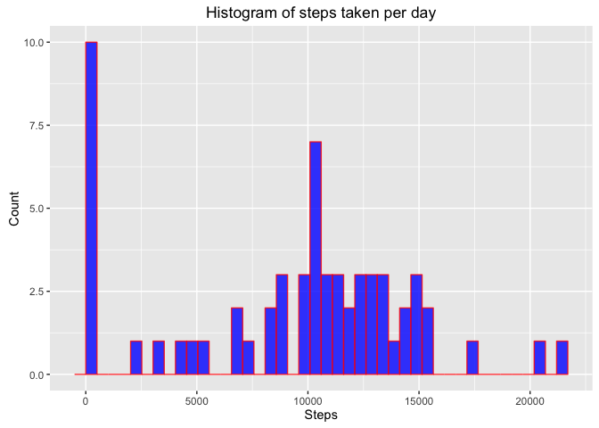
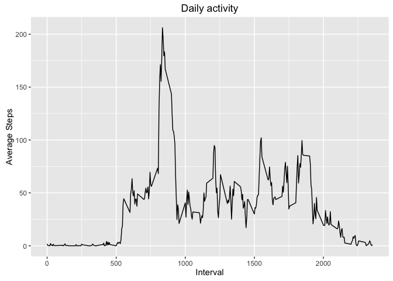
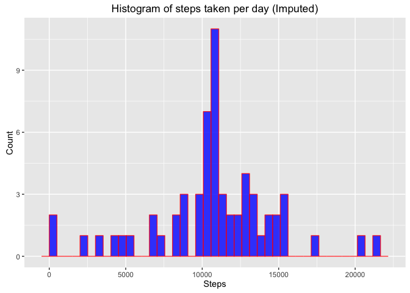
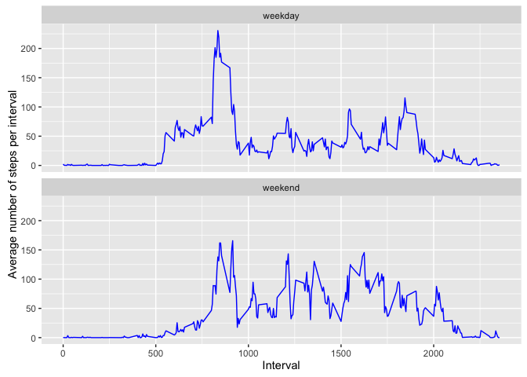

# Reproducible Research: Peer Assessment 1
Baldvin Einarsson  

We start with some initial setup, which includes loading packages and setting global `knitr` options:


```r
library(ggplot2)
library(lubridate)
library(knitr)

opts_knit$set(echo=TRUE, comment="")
```


## Loading and preprocessing the data

The GitHub fork contains a zip file of the data, which we have unzipped. 


```r
fitData <- read.csv(file="activity.csv", header = TRUE, stringsAsFactors = FALSE)
```

Because the last question involves the days of the week, we add that information to the data frame. Also, we add a human readable form of the time of day (format hh:mm).


```r
# Both wday and ymd are from the lubridate package
fitData$dayOfWeek <- wday(ymd(fitData$date),label = TRUE)
```


## What is mean total number of steps taken per day?

Here, we group the data by the date, and sum up the number of steps for each day. Note that we have removed the missing values.


```r
# Group the data by day and sum up the steps, removing NA values:
stepsPerDay <- tapply(X = fitData$steps, 
                      INDEX = fitData$date, 
                      FUN = sum, 
                      na.rm=TRUE)
```

Next, we create a histogram of these values:


```r
ggplot(data=as.data.frame(stepsPerDay), aes(stepsPerDay)) + 
  geom_histogram(col="red", fill="blue", alpha = .8, bins = 42) + 
  labs(title="Histogram of steps taken per day") +
  labs(x="Steps", y="Count")
```



Finally, we calculate the mean and median steps per day:


```r
#NB the mean is actually a character vector after the "rounding"
meanStepsPerDay <- round(mean(stepsPerDay),digits=2)
medianStepsPerDay <- median(stepsPerDay)
```

The mean steps per day is 9354.23 steps/day, and the median is 10395 steps/day.

## What is the average daily activity pattern?

Similar to the previous step, we group the data by the interval, and average the number of steps for each interval (after removing the missing values). Then, we create a data frame for plotting:


```r
# Group the data by interval and average the steps, removing NA values:
aveStepsPerInterval <-  tapply(X = fitData$steps,
                               INDEX = fitData$interval, 
                               FUN = mean, 
                               na.rm=TRUE)

# Then, create a data frame to use with ggplot:
activity <- 
  data.frame(interval = as.numeric(names(aveStepsPerInterval)),
             aveSteps = aveStepsPerInterval,
             stringsAsFactors = FALSE
  )
```

Then, we create a time series plot of the average steps per time interval:


```r
ggplot(data = activity, aes(x = interval, y = aveSteps)) + 
  geom_line() +
  labs(title="Daily activity") +
  labs(x="Interval", y="Average Steps")
```



From this time series, it appears that the most active time of the day is between 8 and 9 am. This probably corresponds to the morning commute.

Finally, we find the most active interval (in average number of step):


```r
mostActiveTime <- activity$interval[which.max(activity$aveSteps)]
```

The value of the `mostActiveTime` is 835.

## Imputing missing values

The total number of missing values, coded as `NA` can be found by

```r
numMissing <- sum(is.na(fitData$steps))
```
which has value 2304.

It also turns out that there are a few days with no recorded values. We can count those, by using the object `stepsPerDay` found above. It contains the total number of steps each day, with some having zero steps. We interpret that as the user having not worn the activity monitor that day, and we find the total number of such days in the following manner:


```r
sum(stepsPerDay<1)
```

```
[1] 8
```

> Note that we are using the fact that `sum(NA,na.rm=TRUE)` equals zero.

To impute the missing values, we generate data that follows a Poisson distribution with mean $\lambda$ equal to the average of the corresponding time interval. The average steps per interval are found in the object `aveStepsPerInterval`, created above.


```r
aveStepsAtMissingVal <- 
  activity$aveSteps[match(fitData$interval[is.na(fitData$steps)],
                          activity$interval)]

# Always set the seed!
set.seed(42)
imputedValues <- mapply(rpois, n=1, lambda= aveStepsAtMissingVal)

# First, we copy the fitData data.frame:
fitDataNoNA <- fitData
# Then, we fill in the missing values:
fitDataNoNA$steps[is.na(fitData$steps)] <- imputedValues
```

For the newly created data frame `fitDataNoNA` we group the data by the date, and sum up the number of steps for each day.


```r
# Group the data by day and sum up the steps:
stepsPerDayNoNA <- tapply(X = fitDataNoNA$steps, 
                      INDEX = fitDataNoNA$date, 
                      FUN = sum)
# NB: We did not need to remove any NA values
```

Next, we create a histogram of these values:


```r
ggplot(data=as.data.frame(stepsPerDayNoNA), aes(stepsPerDayNoNA)) + 
  geom_histogram(col="red", fill="blue", alpha = .8, bins = 42) + 
  labs(title="Histogram of steps taken per day (Imputed)") +
  labs(x="Steps", y="Count")
```



Finally, we calculate the mean and median steps per day for the imputed data:


```r
#NB the mean is actually a character vector after the "rounding"
meanStepsPerDayNoNA <- round(mean(stepsPerDayNoNA),digits=2)
medianStepsPerDayNoNA <- median(stepsPerDayNoNA)
```

For the imputed data, the mean steps per day is 1.076464\times 10^{4} steps/day, and the median is 10765 steps/day. We note that these values are slightly higher as those for the raw data. This is reasonable because missing values do not contribute to the computations.

## Are there differences in activity patterns between weekdays and weekends?

Using the newly created data frame `fitDataNoNA`, with missing values imputed, we now inspect wether there are any differences in activity between weekdays and weekends. First, we add the 


```r
# Add new column:
fitDataNoNA$partOfWeek <- character(nrow(fitDataNoNA))
# Then, set part of week:
fitDataNoNA$partOfWeek[fitDataNoNA$dayOfWeek %in% c("Sat","Sun")] <- "weekend"
fitDataNoNA$partOfWeek[!(fitDataNoNA$dayOfWeek %in% c("Sat","Sun"))] <- "weekday"
# Then, make into a factor:
fitDataNoNA$partOfWeek <- as.factor(fitDataNoNA$partOfWeek)
```

Next, we split the dataframe into parts based on the weekday/weekend classification:


```r
splitData <- split(x = fitDataNoNA, f = fitDataNoNA$partOfWeek)
```

Then, similarly as before, we group the data (for weekdays and weekends separately) by the interval and find hte average number of steps:


```r
# Group the data by interval and average the steps
aveStepsPerInterval.weekday <-  
  tapply(X = splitData[["weekday"]]$steps,
         INDEX = splitData[["weekday"]]$interval, 
         FUN = mean)
# ... and for the weekends:
aveStepsPerInterval.weekend <-  
  tapply(X = splitData[["weekend"]]$steps,
         INDEX = splitData[["weekend"]]$interval, 
         FUN = mean)

# Create a data frame for ggplot:
activityNoNA <- 
  data.frame(interval = c(as.numeric(names(aveStepsPerInterval.weekday)),
                          as.numeric(names(aveStepsPerInterval.weekend))
                          ),
             aveSteps = c(aveStepsPerInterval.weekday,
                          aveStepsPerInterval.weekend),
             partOfWeek = c(rep("weekday",times=length(aveStepsPerInterval.weekday)),
                            rep("weekend",times=length(aveStepsPerInterval.weekend)))
  )
```

Then, we create a time series plot of the average steps per time interval:


```r
ggplot(activityNoNA, aes(x = interval, y = aveSteps, group = partOfWeek)) +
    geom_line(col='blue') +
    labs(x="Interval", y="Average number of steps per interval") +
    facet_wrap( ~ partOfWeek,nrow = 2)
```



Comparign these time series reveals tow major differences. The first one is that the activity during the morning hours of the weekdays is signifcantly higher than over the weekend; this probably corresponds to the morning commute. Second, after the weekday morning commute, the person is not as active as during the weekend, which could correspond to the person being sedentary at work.

We also see that on the weekends, the person's wake up times are not as regulear as those for the weekdays. This can probably be attributed to the person not setting an alarm on the weekend and sleeping in :)
